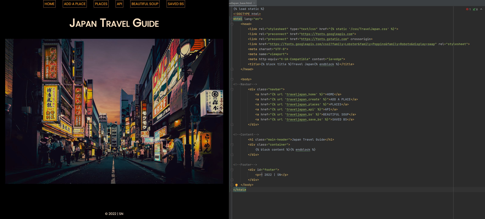

# Python Live Project Code Summary
## Introduction
Having completed a two week long sprint for The Tech Academy Python Live Project, this repository serves as a reference to my process. 

Using the Django Framework and PyCharm, the app I created is a Travel Guide to Japan. 

Featured below are code snippets that show the development of functionality of the code.



## CRUD Functionality
### Create
The first task was to create a model and function for adding a new place to the travel guide database.

```
Function:
def traveljapan_create(request):
    form = AddEntryForm(data=request.POST or None)
    if request.method == 'POST':
        if form.is_valid():
            form.save()
            return redirect('../places')
    content = {'form': form}
    return render(request, 'TravelJapan/TravelJapan_create.html', content)


Model:
from django.db import models

# choices for islands and type of activity
islands = [('Hokkaido', 'Hokkaido'), ('Honshu', 'Honshu'), ('Kyushu', 'Kyushu'),
           ('Shikoku', 'Shikoku'), ('Okinawa', 'Okinawa')]
addTypes = [('Restaurant', 'Restaurant'), ('Sightseeing', 'Sightseeing'), ('Festival', 'Festival'), ('Other', 'Other')]


class AddEntry(models.Model):
    name_of_Place = models.CharField(max_length=50)
    city = models.CharField(max_length=30)
    island = models.CharField(max_length=8, choices=islands)
    activity_Type = models.CharField(max_length=15, choices=addTypes)
    description = models.TextField(max_length=500)
    addDate = models.DateTimeField(auto_now_add=True)

    AddEntries = models.Manager()

    def __str__(self):
        return self.name_of_Place
```

### Read
I developed two views functions, one that displays all items in the database on a details template and another to display all the information about that item.

```
def traveljapan_places(request):
    addEntry = AddEntry.AddEntries.all()
    content = {'addEntry': addEntry}
    return render(request, 'TravelJapan/TravelJapan_places.html', content)

def traveljapan_details(request, pk):
    addEntry = get_object_or_404(AddEntry, pk=pk)
    content = {'addEntry': addEntry}
    return render(request, 'TravelJapan/TravelJapan_details.html', content)
```

### Update and Delete
From the details template, a user can update or delete an entry. The delete function will bring up a delete confirmation page, and then return the user to the details template.

```
def traveljapan_update(request, pk):
    addEntry = get_object_or_404(AddEntry, pk=pk)
    form = AddEntryForm(data=request.POST or None, instance=addEntry)
    if request.method == 'POST':
        if form.is_valid():
            form.save()
            return redirect('../../places')
    content = {'form': form, 'addEntry': addEntry}
    return render(request, 'TravelJapan/TravelJapan_update.html', content)

def traveljapan_delete(request, pk):
    addEntry = get_object_or_404(AddEntry, pk=pk)
    if request.method == 'POST':
        addEntry.delete()
        return redirect('../../places')
    content = {'addEntry': addEntry}
    return render(request, 'TravelJapan/TravelJapan_delete.html', content)
```

## Web Scraping
### Beautiful Soup
To display a list of attractions from a website, I used Beautiful Soup and scrapped the headers for the names of the attractions.

```
def traveljapan_bs(request):
    site = requests.get('https://www.planetware.com/tourist-attractions/japan-jpn.htm')
    soup = BeautifulSoup(site.content, 'html.parser')
    placelist = []
    info = soup.find_all('h2', class_='sitename')
    for i in info:
        placelist += list(i)

    content = {'placelist': placelist}
    return render(request, 'TravelJapan/TravelJapan_bs.html', content)
```

#### Save
[under construction]

## API
I used the [Kanji Alive](https://app.kanjialive.com/api/docs) API on RapidAPI to display a kanji character and it's english meaning.

```
def traveljapan_api(request):
    url = "https://kanjialive-api.p.rapidapi.com/api/public/kanji/%E8%A8%AA"

    headers = {
        "X-RapidAPI-Key": "f3f220457cmsh6cae92504a1567ep160a94jsn96f0abf6f9e3",
        "X-RapidAPI-Host": "kanjialive-api.p.rapidapi.com"
    }

    response = requests.request("GET", url, headers=headers)
    kanji = json.loads(response.text)

# displays character and meaning from a dictionary JSON object
    character = kanji["kanji"]["character"]
    meaning = kanji["kanji"]["meaning"]["english"]

    content = {"character": character, "meaning": meaning}

    return render(request, 'TravelJapan/TravelJapan_api.html', content)
```

## Skills Aquired
### <b>Version Control</b>
Git Version control was used extensively, as all team members worked off of local versions of the same remote repository. I created branches for each of the ten stories and successfully pushed them to the master without merge conflicts, giving me much experience in a professional work environment. I also much more appreciate version control capabilities having had more time and experience in using it during the sprint.

### <b>Researching/Troubleshooting</b>
When running into roadblocks, I searched online for answers. By using numerous different keywords and looking at different search results I became more adept at finding exactly what I was after. I also learned how useful looking at a variety of answers to a problem is, where I could cherry-pick different aspects I wanted to implement into my code.